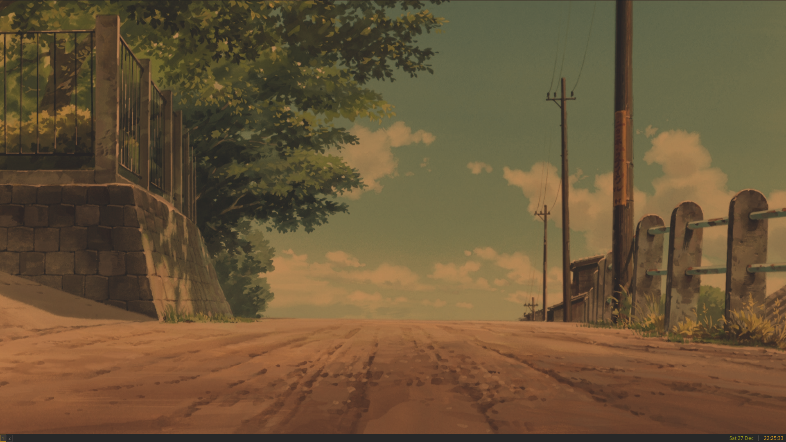
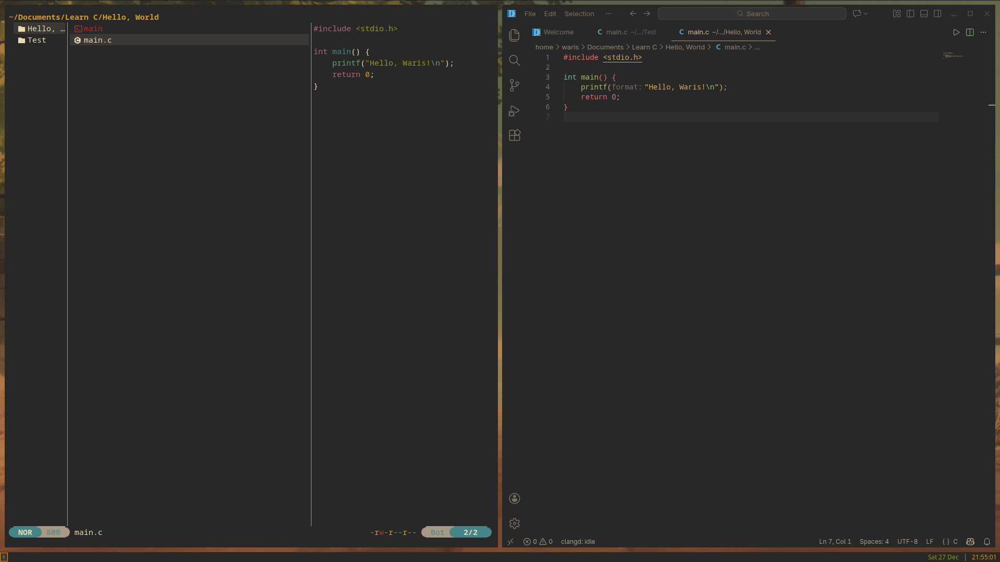
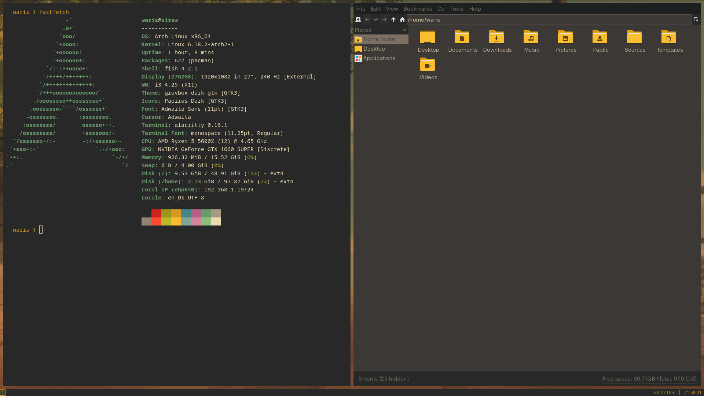
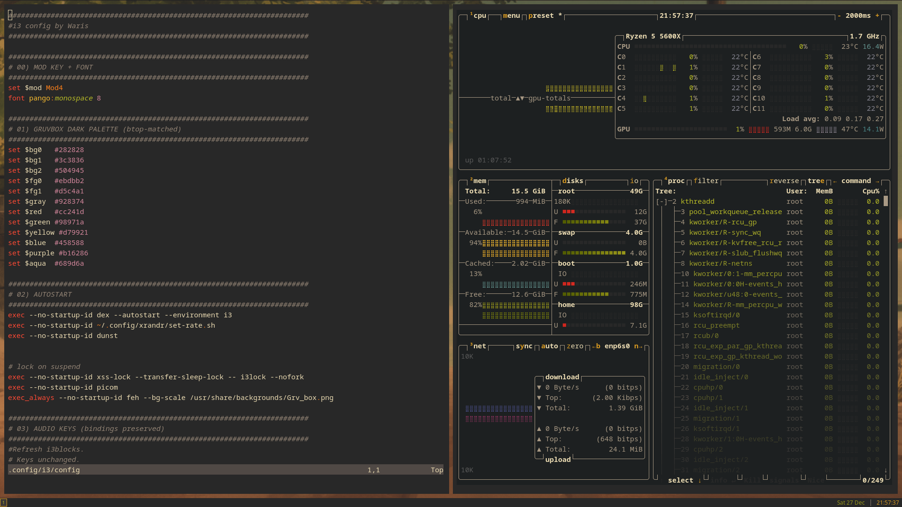
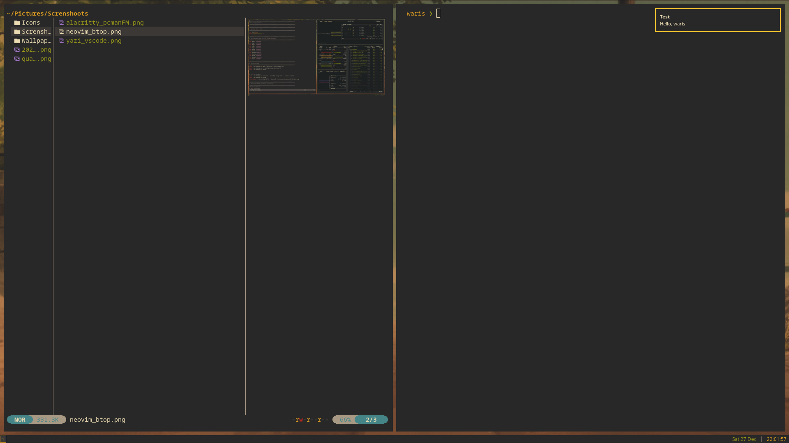

# dotfiles
Personal Arch Linux dotfiles with i3wm and Gruvbox theme.
---
# Instructions

Clone the repository **inside your home directory** (recommended location: `~/Github`), make the installer executable, and run it:

```bash
mkdir -p ~/Github
cd ~/Github
git clone https://github.com/waris-siraw/dotfiles.git
cd dotfiles/dotfiles
chmod +x install.sh
./install.sh
```

## 📸 Screenshots

### 🖥️  Desktop



### 💻  Laptop


### 🧑‍💻  yazi+vscode



### ⌨️  alacritty+pcmanFM



### ⚙️  neovim+btop



### 🔔  dunst


